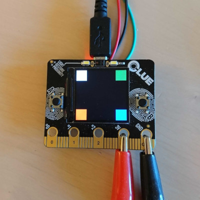
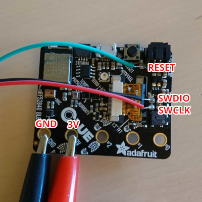

# Zephyr on Adafruit CLUE

As of April 2021, there is no board defined for the
[Adafruit CLUE](https://www.adafruit.com/clue) in the
[Zephyr project](https://www.zephyrproject.org/).
This repository contains an example project and some instructions on how
to get the display working on this board with Zephyr.

## Building
First of all, follow the installation instructions for Zephyr.
Make sure you `source zephyr-env.sh` so you get the required environment
variables in your shell. Next, clone this repository and type `make`.
See the `Makefile` for additional helper commands.

## Flashing
I was not able to flash Zephyr using the default bootloader so I connected
a ST-Link V2 programmer to the debug pads. Using a programmer also allows
you to debug the code using GDB. The programmer needs to be connected
to the RESET, SWDIO, SWDCLK, GND and 3V pins on the board.
Example setup (ignore the cable colors):

In addition to this, you need to connect a battery or an USB cable to give
power to the board. The 3V connector is only used to provide a reference
voltage to the programmer.

If you have [OpenOCD](http://openocd.org/) installed (packaged by most
distros) you can now flash the board by typing `make write`.
If you don't have an ST-Link V2 programmer you have to modify
`openocd.cfg` first.

## License
This code uses the same license as the Zephyr project (Apache License 2.0)
since most of the code is based on samples from there.
